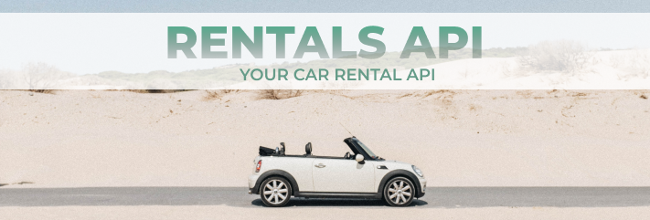

 

<h3 align="center">rentals-api</h3>

---

  Keep track of your car rental in a simple way.
   

  To check the application requirements, [click here](rentals-api/tree/master/docs/REQUIREMENTS.md)
   

