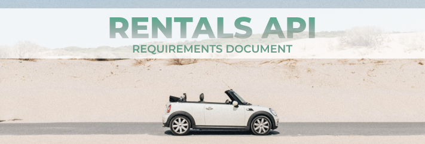

 

Here, all the requirements that were considered for building the API will be listed.

| Legends | Meaning |
|:-------:|:-------:|
|**RF**   | Functional Requirements |
|**RNF**   | Not-Functional Requirements |
|**RN**   | Business Rules |

 
 

# CAR REQUIREMENTS
Requirements for car registration, listing and registration of car specifications.
 
 

### Car Registration

**RF**

- [ ] Must be possible to register a car.
- [ ] Must be possible to list all the categories.

**RN**

- [ ] Must not be possible to register a car with an existing license plate.
- [ ] Must not be possible to change the license plate of an already registered car.
- [ ] The car must be registered as "available" by default.
- [ ] Must not be possible to register a car without an admin user.

### Car Listing

**RF**
- [ ] Must be possible to list all the available cars.
- [ ] Must be possible to list all cars of a brand.
- [ ] Must be possible to list all cars of a category.

**RN**
- [ ] A user does not need to be logged in to view the listing.

### Car Specifications Registration

**RF**
- [ ] Must be possible to register a car specification.
- [ ] Must be possible to list all the car specifications.
- [ ] Must be possible to list all the cars.

**RN**

- [ ] Must not be possible to register a specification for a non-existent car.
- [ ] Must not be possible to register an existent car specification.
- [ ] Must be possible to register more than one car specification.
- [ ] Must not be possible to register a car without an admin user.

### Car Image Registration

**RF**
- [ ] Must be possible to register a car image.
- [ ] Must be possible to list all the cars, availables or not.

**RNF**
- [ ] Multer must be used to upload files.

**RN**
- [ ] Must not be possible to register a car without an admin user.
- [ ] Must be possible to register more than one image for the car.
- [ ] Must not be possible to register an image for a non-existent car.

### Car Rental

**RF**
- [ ] Must be possible to register a car rental.

**RN**

- [ ] Must be possible to rent with a minimum time of 24 hours.
- [ ] Must not be possible to register a new lease for a user who has an open lease.
- [ ] Must not be possible to register a new rental for a car that is already rented.
- [ ] Must not be possible to register a rental for a date prior to the time of rental.
